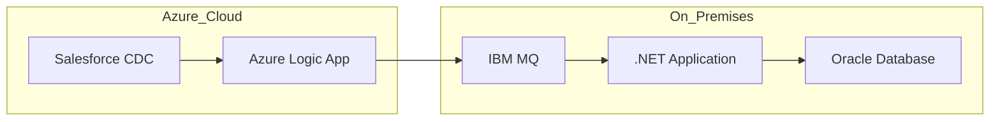

# Enterprise Integration Pattern: Data Pipeline from Salesforce to Oracle Database

In modern enterprises, seamless data integration between cloud applications and on-premises systems is critical for business agility and operational efficiency. This blog explores an enterprise integration pattern for extracting data from Salesforce, transforming it, and loading it into an Oracle database using Azure Logic Apps, IBM MQ, and a .NET application.

## Solution Overview

**Architecture Flow:**
1. **Extract:** Azure Logic App connects to Salesforce using Change Data Capture (CDC) to detect and extract new or changed records in near real-time.
2. **Queue:** The Logic App transforms the data as needed and publishes messages to IBM MQ, a robust enterprise messaging system.
3. **Load:** A .NET application consumes messages from IBM MQ, applies further transformations or validations if required, and loads the data into the Oracle database.

# Architecture Diagram

## Implementation Approach

### 1. Azure Logic App: Extract from Salesforce CDC
- Use the Salesforce connector in Azure Logic Apps to subscribe to CDC events.
- Map and transform Salesforce data to the required schema for downstream processing.
- Handle batching and error scenarios within the Logic App workflow.

### 2. IBM MQ: Reliable Messaging Layer
- Logic App sends transformed data as messages to an IBM MQ queue.
- IBM MQ ensures reliable, durable, and ordered delivery of messages, decoupling the source and target systems.
- Configure dead-letter queues and message persistence for fault tolerance.

### 3. .NET Application: Load into Oracle Database
- The .NET app listens to the IBM MQ queue, retrieves messages, and processes them.
- Apply business logic, data validation, and transformation as needed.
- Insert or update records in the Oracle database using efficient batch operations.
- Implement logging and error handling for traceability.

## Best Practices

- **Idempotency:** Ensure that the .NET loader is idempotent to handle duplicate messages without data corruption.
- **Error Handling:** Use dead-letter queues in IBM MQ and error handling in Logic Apps to capture and alert on failures.
- **Monitoring:** Implement end-to-end monitoring and alerting for each integration component (Logic App, IBM MQ, .NET app, Oracle DB).
- **Security:** Secure connections using managed identities, encrypted channels (TLS), and least-privilege access.
- **Scalability:** Design the .NET app and Logic App for horizontal scaling to handle variable data volumes.

## Data Loss Prevention & Resiliency

- **Guaranteed Delivery:** IBM MQ provides message durability and guaranteed delivery, reducing the risk of data loss during network or system failures.
- **Transactional Processing:** Use transactions in both the Logic App (where supported) and the .NET app to ensure atomicity.
- **Retry Policies:** Configure retries in Logic Apps and the .NET app for transient failures.
- **Checkpointing:** Track processed messages to avoid reprocessing or missing data.
- **Disaster Recovery:** Regularly back up IBM MQ and Oracle DB, and test failover procedures.

## Conclusion

This integration pattern leverages cloud-native and enterprise-grade tools to build a resilient, scalable, and secure data pipeline from Salesforce to Oracle. By following best practices in error handling, monitoring, and security, organizations can ensure reliable data movement and minimize operational risks.
