# A robust data governance framework provides operational excellence, risk mitigation, and a foundation for analytics and AI success in modern enterprises.

A data governance framework is a structured set of principles, policies, roles, and processes that ensures data is managed as a valuable business asset within an organization. It provides a foundation for organizations to protect, control, and maximize the value of their data, aligning data management activities with corporate goals and regulatory requirements.

## Data Governance Framework Development Process

The following diagram illustrates the systematic approach to developing a comprehensive data governance framework:

```mermaid
flowchart TD
    Start([Start Governance Initiative]) --> Assess{Assessment Phase}
    
    %% Step 1: Define Critical Data Components
    Assess --> Step1[Step 1: Define Critical Data Sources, Consumers, and Owners]
    Step1 --> DataSources[🗂️ Identify Data Sources<br/>• Databases<br/>• Applications<br/>• External APIs<br/>• Cloud Storage]
    Step1 --> DataConsumers[👥 Map Data Consumers<br/>• Business Users<br/>• Analytics Teams<br/>• Applications<br/>• Partners]
    Step1 --> DataOwners[👑 Assign Data Owners<br/>• Business Stewards<br/>• Technical Owners<br/>• Subject Matter Experts<br/>• Compliance Officers]
    
    DataSources --> Step2[Step 2: Establish Processes for Validation, Protection, and Integrity]
    DataConsumers --> Step2
    DataOwners --> Step2
    
    %% Step 2: Establish Core Processes
    Step2 --> Validation{🔍 Data Validation<br/>Processes}
    Step2 --> Protection{🛡️ Data Protection<br/>Measures}
    Step2 --> Integrity{✅ Data Integrity<br/>Controls}
    
    Validation --> ValProcesses[• Quality Rules<br/>• Automated Checks<br/>• Exception Handling<br/>• Correction Workflows]
    Protection --> ProtProcesses[• Access Controls<br/>• Encryption<br/>• Classification<br/>• Privacy Policies]
    Integrity --> IntProcesses[• Lineage Tracking<br/>• Change Management<br/>• Audit Trails<br/>• Version Control]
    
    ValProcesses --> Step3[Step 3: Set Up Monitoring, Feedback Loops, and Continuous Maturity Roadmap]
    ProtProcesses --> Step3
    IntProcesses --> Step3
    
    %% Step 3: Monitoring and Continuous Improvement
    Step3 --> Monitoring[📊 Monitoring Framework]
    Step3 --> Feedback[🔄 Feedback Loops]
    Step3 --> Roadmap[🗺️ Maturity Roadmap]
    
    Monitoring --> MonProcesses[• KPI Dashboards<br/>• Performance Metrics<br/>• Compliance Reports<br/>• Issue Tracking]
    Feedback --> FeedProcesses[• Stakeholder Input<br/>• User Experience<br/>• Process Optimization<br/>• Training Needs]
    Roadmap --> RoadProcesses[• Capability Assessment<br/>• Gap Analysis<br/>• Improvement Plans<br/>• Technology Evolution]
    
    MonProcesses --> Step4[Step 4: Align Initiatives with Business Strategy and Regulatory Requirements]
    FeedProcesses --> Step4
    RoadProcesses --> Step4
    
    %% Step 4: Strategic Alignment
    Step4 --> Business{🎯 Business Strategy<br/>Alignment}
    Step4 --> Regulatory{📋 Regulatory<br/>Compliance}
    
    Business --> BizAlignment[• Strategic Objectives<br/>• ROI Measurement<br/>• Business Value<br/>• Stakeholder Buy-in]
    Regulatory --> RegAlignment[• Legal Requirements<br/>• Industry Standards<br/>• Audit Readiness<br/>• Risk Management]
    
    %% Implementation and Outcomes
    BizAlignment --> Implementation[🚀 Implementation Phase]
    RegAlignment --> Implementation
    
    Implementation --> Outcomes[📈 Expected Outcomes]
    
    Outcomes --> OutcomeList[• Operational Excellence<br/>• Risk Mitigation<br/>• Analytics Foundation<br/>• AI Success Enablement<br/>• Compliance Achievement<br/>• Business Value Delivery]
    
    %% Feedback loop for continuous improvement
    OutcomeList --> ContinuousImprovement{Continuous Improvement}
    ContinuousImprovement -->|Regular Review| Step3
    ContinuousImprovement -->|Major Changes| Assess
    
    %% Styling
    classDef stepClass fill:#e1f5fe,stroke:#01579b,stroke-width:2px,color:#000
    classDef processClass fill:#f3e5f5,stroke:#4a148c,stroke-width:2px,color:#000
    classDef outcomeClass fill:#e8f5e8,stroke:#1b5e20,stroke-width:2px,color:#000
    classDef decisionClass fill:#fff3e0,stroke:#e65100,stroke-width:2px,color:#000
    
    class Step1,Step2,Step3,Step4 stepClass
    class DataSources,DataConsumers,DataOwners,ValProcesses,ProtProcesses,IntProcesses,MonProcesses,FeedProcesses,RoadProcesses,BizAlignment,RegAlignment stepClass
    class Validation,Protection,Integrity,Monitoring,Feedback,Roadmap,Business,Regulatory processClass
    class Outcomes,OutcomeList outcomeClass
    class Assess,ContinuousImprovement decisionClass
```

## Key Components of a Data Governance Framework

**Strategic Foundation:** Establishes clear objectives, scope, guiding principles, and alignment to business goals and compliance needs.

**Roles and Responsibilities:** Defines ownership, accountability, and stewardship for data, including data owners, stewards, custodians, and consumers.

**Policies and Procedures:** Documents rules for data handling, classification, retention, privacy, security, and sharing across the organization.

**Data Quality Management:** Implements measures and systems to maintain data accuracy, completeness, consistency, and reliability.

**Data Catalog and Metadata Management:** Centralizes metadata and lineage tracking, enabling easy discovery, understanding, and monitoring of data assets.

**Security and Compliance:** Applies protections and ensures adherence to regulatory standards like GDPR, HIPAA, and SOX to safeguard sensitive data.

**Integration and Interoperability:** Ensures data can be shared and integrated across systems with standard formats, APIs, and governance over ETL/ELT processes.

**Change Management and Stewardship:** Maintains governance through updates, communication protocols, and active stakeholder engagement.

**Training and Education:** Promotes data literacy and policy adoption through ongoing education tailored to roles.

**Performance Measurement:** Continuously tracks the effectiveness of the framework through defined metrics, audits, and improvement cycles.

## Framework Examples and Methodologies

**DAMA-DMBOK:** Widely recognized standard with disciplines for data governance, architecture, quality, security, and metadata.

**ISO 8000:** International standards for data quality management and metadata practices.

**NIST Privacy Framework:** Structured for privacy risk management and compliance assessment.

**DGI (Data Governance Institute):** Lays out processes for roles, stewardship, and policies, suited for complex enterprises.

## Key features of Microsoft Purview:

**Unified Data Catalog:** Automatically discovers, classifies, and catalogs data assets across Azure Data Lake, SQL, Synapse, Power BI, Cosmos DB, and also supports external cloud and on-premises sources.

**Automated Metadata Harvesting:** Continuously scans, extracts, and indexes metadata from data sources to help users search and discover data easily.

**Sensitive Data Identification:**  Detects and applies protection to sensitive information—with built-in classification and labeling.

**End-to-End Lineage Visualization:**  Maps data movement across the data estate, providing full lineage and impact analysis for compliance and troubleshooting.

**Policy Enforcement and Compliance Management:**  Integrates with data protection and governance frameworks, supporting privacy, regulatory, and internal policies.

**Extensibility:**  Offers APIs and connectors to accommodate diverse enterprise requirements across hybrid and multi-cloud environments.

## Use Cases:

- Enterprise data governance and compliance management.

- Building a trustworthy data catalog for analysts, data scientists, and business users.

- Automating data discovery, security monitoring, and access policies.

- Supporting audit, privacy-first analytics, and risk management initiatives.